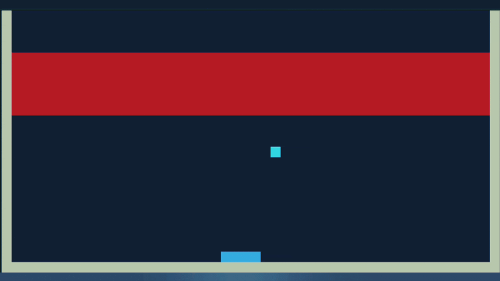

# BrikCrash


A terminal-based clone of the classic Atari Breakout game written entirely in C.

BrikCrash runs directly inside the terminal and uses the custom **Terrenity** graphics engine for rendering, input handling, and frame management. The project demonstrates game development concepts such as collision detection, object management, game loops, and terminal graphics programming without relying on external game frameworks.

---

## Gameplay

<p align="center">
    
</p>

---

## Features

- Pure C implementation
- Terminal-based graphics
- Real-time keyboard input
- Paddle and ball physics
- Brick collision system
- Multiple bounce angles
- Lightweight and dependency-free
- Powered by the Terrenity graphics engine

---

## Build on OpenBSD

compiling with clang
```sh
make
```
or with gcc
```sh
make CC=gcc
```

## Build on Linux

compiling with clang
```sh
make -f GMakefile
```
or with gcc
```sh
make CC=gcc -f GMakefile
```

The executable will be generated after a successful build.

---

## Running (press q to quit)

```sh
./brikcrash
```

---

## Technical Highlights

BrikCrash was built as a systems-programming-oriented game project and includes:

- Fixed timestep game loop
- Custom collision detection
- Terminal rendering engine
- Object-oriented style design in C
- Modular game components

### Game Objects

- Background
- Paddle
- Ball
- Bricks
- Keyboard Controller

---

## About Terrenity

BrikCrash is built on top of **Terrenity**, a terminal graphics engine written in pure C.

Terrenity provides:

- Terminal drawing primitives
- Frame buffering
- Pixel-based rendering
- Input handling
- ANSI escape utilities

---

## Requirements

- Unix-like (any unix-like that includes `termios.h`)
- C99 Compiler
- POSIX-compatible terminal

Tested with:

- CLANG
- GCC

---

## Why This Project?

Most Breakout clones rely on graphical frameworks such as SDL, SFML, Raylib, or OpenGL.

BrikCrash takes a different approach by rendering everything directly in the terminal, making it an interesting project for learning:

- Systems Programming
- Terminal Graphics
- Game Loops
- Collision Detection
- Low-Level C Development

---

## License

This project is licensed under the terms of the LICENSE file.
